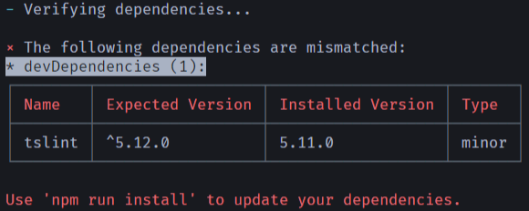

# verify-deps

Checks if installed dependencies are matched with that specified in `package.json`.

## Preview



## Installation

```bash
$ npm install --save-dev verify-deps
```

## Usage

```bash
$ npx verify-deps
```

## License

[MIT](./LICENSE)
